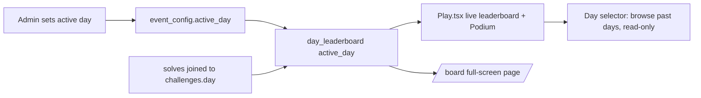

# KGSP CTF — Project Context (for AI agents & devs)

This file gives future agents the mental model needed to make changes safely.
Update it whenever the architecture, schema, or conventions change.

## Stack

- **Frontend:** Vite + React 18 + TypeScript + Tailwind CSS (SPA)
- **Backend:** Supabase (Postgres + RLS + Realtime). **No Supabase Auth.**
- **Hosting:** Vercel (SPA rewrite to `index.html`)
- **Supabase project id:** `xehzdlfrzlokwvtcfvjx`

## Identity model (important)

There is **no Supabase Auth**. Instead:

- **Players** register with username + password + emoji avatar. Passwords are
  bcrypt-hashed (`extensions.crypt`). Each player gets a secret `token` (uuid).
  All player mutations go through `SECURITY DEFINER` RPCs that verify the token.
- **The admin is a normal player account** with `is_admin = true`: username
  `kasut_kgsp_ctf`, password `kasut_kgsp_ctf`. There is **no separate `/admin`
  password screen** — `login_player`/`register_player` are the only login paths.
  When `is_admin` is true, `login_player` also returns `admin_token` (the
  `admin_config.secret`), which the frontend stores on the `Player` object and
  passes as `p_secret` to every `admin_*` RPC. `/admin` and `/board` both check
  `player.is_admin` from context; if false, they show an "Instructors only"
  screen instead of the dashboard. The admin account is excluded from the
  `leaderboard` view, `day_leaderboard()`, `admin_list_players()`, and
  `admin_overview().players_count`.
- Flags & hints live in tables with **RLS enabled but no SELECT policy**, so clients
  can never read them — only the RPCs can.
- **`pg-safeupdate` is enabled** on this Supabase project — any `DELETE`/`UPDATE`
  without a `WHERE` clause is rejected, even inside `SECURITY DEFINER` functions.
  Always add `where true` for intentional full-table deletes (see `admin_reset`,
  `admin_delete_all_players`).

## Database

### Key tables
- `players` — id, username, token, password_hash, avatar, created_at, **is_admin**
- `challenges` — id, title, category, difficulty (`easy`|`medium`|`hard`|`danger`),
  points, first_blood_bonus, sort_order, prompt, asset_url, action_url, num_hints,
  day, is_extra, suggested_tool (kept in schema but no longer shown to players)
- `challenge_flags` — challenge_id, flag (SECRET)
- `challenge_hints` — challenge_id, hint_number, body, penalty (SECRET). Only
  hint_number = 1 is ever surfaced in the UI — treat challenges as single-hint.
- `solves` — player_id, challenge_id, points_awarded, is_first_blood, solved_at
- `hint_unlocks` — records penalties per player/challenge/hint
- `submission_attempts` — rate limiting
- `days` — day, title, subtitle, is_open, event_label, sort_order, is_rest, requires_code
- `day_codes` — day, code (SECRET; RLS no-policy)
- `event_config` — id=1, name, starts_at, ends_at, duration_minutes (default 35),
  freeze_minutes (**always 0 — the freeze/blackout feature was removed, see
  below**), **active_day** (which day's leaderboard is "live")
- `admin_config` — id=1, secret, username, password_hash (legacy fields from the
  old direct `/admin` login; still used only as the source of the `admin_token`)
- `leaderboard` (view) — all-time board, **excludes is_admin players**
- `day_leaderboard(p_day int)` (RPC) — the **active, day-scoped** board used for
  the live UI; every non-admin player appears (0 if no solves that day yet)

### Key RPCs
Player: `register_player(username,password,avatar)`, `login_player(username,password)`
(returns `is_admin` + `admin_token`), `submit_flag(...)`, `unlock_hint(...)` (free once
solved), `check_day_code(day,code)`, `day_leaderboard(day)`.

Admin (all take the `admin_token`/secret from a `login_player` call where
`is_admin = true`): `admin_overview`, `admin_start_event`, `admin_stop_event`,
`admin_reset`, `admin_set_day`, `admin_set_freeze`, `admin_set_day_code`,
`admin_set_active_day`, `admin_list_players`, `admin_delete_player`,
`admin_delete_all_players`. (`admin_login` still exists for direct
username/password admin auth but is no longer called by the frontend.)

> pgcrypto lives in the `extensions` schema — always call `extensions.crypt` /
> `extensions.gen_salt` inside functions that set `search_path = public, extensions, pg_temp`.

## Day / challenge structure

- Curriculum runs **Day 3 → Day 10** (Days 1 "Introduction to Cybersecurity" and
  2 "Securing Accounts" were deleted from the `days` table — they were empty
  placeholders with no challenges/codes/solves attached, so the roadmap now
  starts at Day 3). Day 3 Securing Data is **the only day with live challenges**
  (open + code-gated `SECURING-DATA`); Day 4 Securing Networks, Day 5 Privacy,
  Day 6 Introduction to Pentesting, Day 7 Web Applications, Day 8 Web Application
  Hacking, Day 9 Blockchain Introduction, Day 10 Smart Contracts are locked
  placeholders until challenges are authored for them. Day numbers are stored
  as plain integers (no re-sequencing needed after the delete — `day` is not an
  array index).
- Challenges belong to a **day**; each day holds both its core and any `is_extra`
  (bonus) challenges together (there is **no** separate global bonus day).
- **Difficulty tiers:** `easy` → `medium` → `hard` → `danger` (☠, fuchsia styling,
  the hardest tier).
- **Prompt style:** short, clean scenario + artifact + goal. **No tool names, no
  step-by-step instructions** — students must research and think for themselves.
  `suggested_tool` still exists as a DB column but the frontend no longer renders
  it to players.
- **Hints:** at most **one** hint per challenge (`num_hints` should be 0 or 1).
  Revealing it always shows a confirmation warning ("this costs points") unless
  the challenge is already solved, in which case it's free.
- **`is_extra`** (boolean): marks a challenge as optional bonus practice. In
  `Play.tsx`, each day renders its non-extra challenges first, then any
  `is_extra` ones under a "🎁 Extra Challenges" heading — still inside the same day.

## Active-day leaderboard (resets per day, keeps history)



- `useGame.ts` fetches `day_leaderboard(activeDay)` instead of the all-time
  `leaderboard` view for the "live" board (`game.leaderboard`). It refetches
  automatically whenever `event_config` changes and `active_day` differs.
- **No freeze/blackout.** The board is live the entire round; standings are never
  hidden mid-event. `isFrozen()` still exists in `time.ts` (dead code, kept in
  case a future freeze feature returns) but nothing calls it, `freeze_minutes` is
  pinned at 0, and `AdminPanel.tsx` has no freeze input. The finale (`Podium.tsx`)
  is purely an optional "make it dramatic" reveal shown when the timer hits zero
  — it does not gate visibility beforehand.
- `Leaderboard.tsx` renders a **custom themed day-picker** (button + absolutely
  positioned menu inside the card, closes on outside-click/Escape) instead of a
  native `<select>` — the native popup rendered outside the panel's frame. `Play.tsx`
  computes `boardDays` (memoized) to feed it only days that have at least one solve
  plus the current active day, so the picker doesn't fill with the 7 empty locked
  days. The component itself is wrapped in `memo()` so the arena's 1s clock tick
  doesn't re-render/flicker it.
- Leaderboard sort (`sortLeaderboard` in `api.ts`, shared by `fetchLeaderboard` and
  `fetchDayLeaderboard`) has a **stable final tiebreak on `player_id`** so
  identically-scored rows keep a fixed order across refetches instead of visibly
  reshuffling every update.
- Students can still browse any previous day's board via the day-selector
  (one-off fetch, not realtime) without affecting the live view. No scores are
  ever deleted when the active day changes.
- Personal profile score (`game.myPoints`, shown in the header) stays **all-time**
  by design — only the competitive ranking board is day-scoped.

## File map

```
src/
  App.tsx                  routes: / (Play), /admin (AdminPanel), /board (Board), /challenge/admin-panel
  lib/
    api.ts                 all Supabase RPC + table calls
    types.ts               shared TS types (Player.is_admin/admin_token, EventConfig.active_day)
    supabase.ts            client (anon key)
    session.ts             player localStorage (kgsp_ctf_player) — admin session rides along
    app-context.tsx        player, mute, theme context
    useGame.ts             loads challenges/days/solves/day-scoped leaderboard + realtime
    time.ts                event state (idle/running/ended); isFrozen() is dead code,
                            freeze is no longer used anywhere
    sounds.ts              Web Audio synthesized SFX, routed through a shared master
                            gain + DynamicsCompressorNode so layered notes never clip;
                            warm sine/triangle voices + lowpass-filtered noise (no
                            harsh raw sawtooth/static). playFirstBlood() tries
                            /sounds/first-blood.mp3|.wav before falling back to synth
    theme.ts               dark/light
    constants.ts           AVATARS list
  components/
    Register.tsx           horizontal login/register (alias + password + avatar);
                            also reused as the login gate on /admin and /board
    ChallengeCard.tsx       grid card; danger tier styling
    ChallengeModal.tsx      prompt only (no tool hints shown); single hint w/ warning
    Leaderboard.tsx         day-scoped board + custom in-frame day-browser picker
                            (not a native <select>); memoized against per-second
                            re-renders
    Podium.tsx              Kahoot-style 3-2-1 finale, slow paced with real countdowns
    ProfileModal.tsx        slide-out side panel (all-time score, rank, solves, logout)
    Timer.tsx               countdown with color states
    Toasts.tsx              live solve / first-blood announcements
    Prompt.tsx              safe markdown subset renderer
  pages/
    Play.tsx                main arena: collapsible per-day sections (arrow expander,
                             challenge count), code gate, event banner, GO overlay,
                             admin-only Admin/Board header links
    AdminPanel.tsx          role-gated (player.is_admin) dashboard: event, active day,
                             days+codes, players, challenges (grouped by day under
                             collapsible headers), music — no password form, no freeze
    Board.tsx               admin-only full-screen projector dashboard at /board,
                             with a "‹ Back to arena" link; always live (no freeze)
    CookieChallenge.tsx     the cookie-tampering web challenge
```

## Conventions

- **Theme:** terminal palette via CSS variables in `index.css`; Tailwind colors are
  `terminal-*`. Dark mode is default (`data-theme` on `<html>`). Danger tier uses
  Tailwind's built-in `fuchsia-*` since it's outside the terminal palette.
- **Rendering perf (do not regress):** the leaderboard used to visibly "shimmer".
  Root cause was a full-screen fixed CRT scanline (`body::after`) with
  `mix-blend-mode: overlay` — any repaint (a ticking clock, a pulsing podium
  countdown, an `animate-flicker`) forced the whole viewport to re-blend. **Never
  put `mix-blend-mode` on a full-viewport element**, and avoid full-screen
  `backdrop-blur` over live content (the Podium/GO/header overlays are plain
  semi-opaque now). The arena clock (`Play.tsx`) re-renders only at the event's
  start/end boundaries (`setTimeout`), not every second — the live countdown is
  driven solely by `<Timer/>`, which itself stops ticking once the event ends.
- **Sounds:** synthesized in `sounds.ts` by default; `playFirstBlood()` can be
  overridden by dropping `public/sounds/first-blood.mp3` or `.wav`. Respect global mute.
- **Avatars:** emoji from `constants.ts` `AVATARS`.
- **Animations:** defined in `tailwind.config.js` (flicker, slide-down, slide-left, pop, pulse-ring, rise).
- **Realtime:** `useGame.ts` subscribes to `solves`, `players`, `event_config`, `days`.

## Adding a challenge (quick)

Insert into `challenges` + `challenge_flags` (+ optional single `challenge_hints`
row), set its `day` and `difficulty` (easy/medium/hard/danger), drop any asset into
`public/challenges/...`, then open that day in `/admin`. Keep prompts free of tool
names/steps. See `ADMIN_MANUAL.md` section 10 for the exact SQL.
