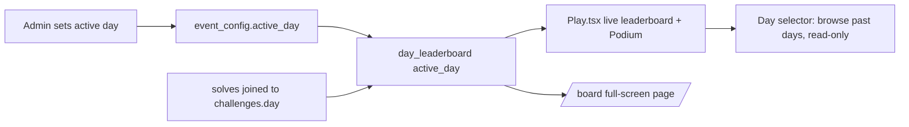

# KGSP CTF — Project Context (for AI agents & devs)

This file gives future agents the mental model needed to make changes safely.
Update it whenever the architecture, schema, or conventions change.

## Stack

- **Frontend:** Vite + React 18 + TypeScript + Tailwind CSS (SPA)
- **Backend:** Supabase (Postgres + RLS + Realtime). **No Supabase Auth.**
- **Hosting:** Vercel (SPA rewrite to `index.html`; auto-deploys on push to `master`)
- **Supabase project id:** `xehzdlfrzlokwvtcfvjx` (org project name `meras-ctf`)

## Current state at a glance (updated 2026-07-09)

- **Live event day:** **Day 4 "Securing Networks"** is the active authored day.
  Day 3 "Securing Data" has authored challenges but is closed; **Day 5 "Privacy"
  has 10 authored v2 challenges** (3 easy, 4 medium, 2 hard, 1 danger, all dynamic);
  Days 6–10 are placeholders.
- **Day 4 = 7 core + 2 extra, ALL `is_dynamic` (per-player flags).** Core =
  artifact/tool challenges (Wireshark pcap, file-carving, EXIF+maps, CyberChef,
  AES, live SNMP). Extras = reworked `cookie` (cookie-tamper) and `chain`
  (recon/stego). (The 3 "target box" nmap/Wireshark/dig extras that needed an
  instructor-shared IP were **removed 2026-07-08** — 0 solves, no scores lost;
  `target-box/` is gone.)
- **Day 5 = Privacy v2 (2026-07-09).** Full rewrite — 3 easy / 4 medium / 2 hard /
  1 danger, all `is_dynamic`. Mix of live browser pages (`p5_cache_phantom`,
  `p5_consent_labyrinth`, `p5_mask_match`) and forensics artifacts (sqlite, zip,
  pcap, har, carved png). IDs: `p5_cache_phantom`, `p5_bookmark_vault`,
  `p5_consent_labyrinth`, `p5_profile_archive`, `p5_dns_whisper`,
  `p5_tracker_ghost`, `p5_briefing_carve`, `p5_mask_match`, `p5_exit_witness`,
  `p5_reidentified`. Live keys via `challenge_live_material` on hard/danger +
  `p5_briefing_carve`. Regenerate artifacts: `scripts/gen-day5-artifacts.py`.
- **Day 3 = 4 core + 3 extra, ALL static** (`challenge_flags`, simple text answers):
  core `lab_stego, lab_encrypt, hash, lab_vault`; extra `base64, caesar, stego`.
- **No Day 4/5 flag is a static string in the client bundle or the DB** — every one
  is minted server-side per player (`verify_challenge_answer`, HMAC of `player_id`).
  This anti-AI / anti-sharing rework is the design default; the full "why" and
  design rules live in `ADMIN_MANUAL_DAY4.md`.

## Repository layout

```
src/                  the SPA (detailed File map below)
public/               static assets served at web root
  challenges/         downloadable challenge artifacts (day4/*, day5/*,
                      vault.png, hidden.png) + s3cr3t-vault.html, robots.txt
scripts/              gen-day4-artifacts.py, gen-day5-artifacts.py (regenerate
                      challenge artifacts), gen-stego.mjs
supabase/             schema.sql (accurate reference snapshot) + migrations/ +
                      seed.example.sql; the live Supabase project is the source of
                      truth (migrations applied via MCP)
ADMIN_MANUAL.md       general instructor run-sheet
ADMIN_MANUAL_DAY4.md  Day 4 answer key + AI-resistance design rules + box setup
ADMIN_MANUAL_DAY5.md  Day 5 answer map + expected recoveries
.cursor/skills/manage-ctf-challenges/SKILL.md   add/edit/delete challenge workflow
```

## Identity model (important)

There is **no Supabase Auth**. Instead:

- **Players** register with username + password + emoji avatar. Passwords are
  bcrypt-hashed (`extensions.crypt`). Each player gets a secret `token` (uuid).
  All player mutations go through `SECURITY DEFINER` RPCs that verify the token.
- **The admin is a normal player account** with `is_admin = true`: username
  `kasut_kgsp_ctf`, password `kasut_kgsp_ctf`. There is **no separate `/admin`
  password screen** — `login_player`/`register_player` are the only login paths.
  When `is_admin` is true, `login_player` also returns `admin_token` (the
  `admin_config.secret`), which the frontend stores on the `Player` object and
  passes as `p_secret` to every `admin_*` RPC. `/admin` and `/board` both check
  `player.is_admin` from context; if false, they show an "Instructors only"
  screen instead of the dashboard. The admin account — and any player the
  instructor flags `exclude_from_board` (a per-player toggle in the dashboard
  Players list, for test accounts) — is excluded from the `leaderboard` view,
  `day_leaderboard()`, and the live feed, and `submit_flag` **verifies but never
  records** their submissions (test mode) so they can never score, take first
  blood, or appear on the board. `admin_list_players()` still lists non-admin
  players (including excluded ones, with an `exclude_from_board` flag to toggle);
  `admin_overview().players_count` counts non-admin players.
- Flags & hints live in tables with **RLS enabled but no SELECT policy**, so clients
  can never read them — only the RPCs can.
- **`pg-safeupdate` is enabled** on this Supabase project — any `DELETE`/`UPDATE`
  without a `WHERE` clause is rejected, even inside `SECURITY DEFINER` functions.
  Always add `where true` for intentional full-table deletes (see `admin_reset`,
  `admin_delete_all_players`).

## Database

### Key tables
- `players` — id, username, token, password_hash, avatar, created_at, **is_admin**,
  **exclude_from_board** (hide test/instructor accounts from the whole competition)
- `challenges` — id, title, category, difficulty (`easy`|`medium`|`hard`|`danger`),
  points, first_blood_bonus, sort_order, prompt, asset_url, action_url, num_hints,
  day, is_extra, suggested_tool (kept in schema but no longer shown to players),
  **is_dynamic** (bool — see "Dynamic per-player flags" below)
- `challenge_flags` — challenge_id, flag (SECRET). Only used when
  `is_dynamic = false`. Several Day 4 challenges have **no row here anymore** —
  see `challenge_answer_keys` instead.
- `challenge_answer_keys` — challenge_id, answer (SECRET — the value a player
  must recover & submit), secret (SECRET — random per-challenge HMAC seed),
  live_material (SECRET jsonb — e.g. a decode key, returned only via
  `challenge_live_material`, deliberately never shipped in a downloadable
  artifact). Backs every `is_dynamic = true` challenge.
- `challenge_hints` — challenge_id, hint_number, body, penalty (SECRET). Only
  hint_number = 1 is ever surfaced in the UI — treat challenges as single-hint.
  Hints may nudge *what to look at*; never state the algorithm/tool chain.
- `solves` — player_id, challenge_id, points_awarded, is_first_blood, solved_at
- `hint_unlocks` — records penalties per player/challenge/hint
- `submission_attempts` — rate limiting
- `days` — day, title, subtitle, is_open, event_label, sort_order, is_rest, requires_code
- `day_codes` — day, code (SECRET; RLS no-policy)
- `day_entries` — (player_id, day) — records **who entered (unlocked the code
  for) each day**. Written only by `check_day_code`. This is what makes the
  leaderboard show real competitors instead of every registered account. In
  realtime so a new entrant appears on everyone's board instantly.
- `event_config` — id=1, name, starts_at, ends_at, duration_minutes (default 35),
  freeze_minutes (**default 15 — final-minutes score blackout on the projector
  /board; see "Score freeze" below**), **active_day** (which day's leaderboard is "live")
- `admin_config` — id=1, secret, username, password_hash (legacy fields from the
  old direct `/admin` login; still used only as the source of the `admin_token`)
- `leaderboard` (view) — all-time board, **excludes is_admin AND
  exclude_from_board players**
- `day_leaderboard(p_day int)` (RPC) — the **active, day-scoped** board used for
  the live UI; every non-admin, non-excluded player appears (0 if no solves that day yet)

### Key RPCs
Player: `register_player(username,password,avatar)`, `login_player(username,password)`
(returns `is_admin` + `admin_token`), `submit_flag(...)`, `unlock_hint(...)` (free once
solved), `check_day_code(player_id, token, day, code)` (**verifies the token and
records the player into `day_entries` on success** — this is how "who entered"
is tracked), `day_leaderboard(day)` (**returns only entrants of that day**, incl.
0-point ones, admin excluded).

Admin (all take the `admin_token`/secret from a `login_player` call where
`is_admin = true`): `admin_overview`, `admin_start_event`, `admin_stop_event`,
`admin_reset`, `admin_set_day`, `admin_set_freeze`, `admin_set_day_code`,
`admin_set_active_day`, `admin_list_players`, `admin_delete_player`,
`admin_delete_all_players`. (`admin_login` still exists for direct
username/password admin auth but is no longer called by the frontend.)

Dynamic-flag: `verify_challenge_answer(player_id, token, challenge_id, answer)`
checks the answer against `challenge_answer_keys` and, on success, returns
`flag` — a **personal** flag (`HMAC(player_id, secret)`, never stored, never
the same for two players). `challenge_live_material(player_id, token,
challenge_id)` returns any `live_material` for that challenge (day must be
open). Neither awards points — the player still pastes the returned flag into
`submit_flag`, which for `is_dynamic` challenges recomputes the same HMAC
instead of doing a `challenge_flags` lookup.

> pgcrypto lives in the `extensions` schema — always call `extensions.crypt` /
> `extensions.gen_salt` / `extensions.hmac` inside functions that set
> `search_path = public, extensions, pg_temp`.

## Day / challenge structure

- Curriculum runs **Day 3 → Day 10** (Days 1 "Introduction to Cybersecurity" and
  2 "Securing Accounts" were deleted from the `days` table — they were empty
  placeholders with no challenges/codes/solves attached, so the roadmap now
  starts at Day 3). **Day 3 Securing Data** (code `SECURING-DATA`) and **Day 4
  Securing Networks** and **Day 5 Privacy** have authored challenges; Day 6
  Introduction to Pentesting, Day 7 Web Applications, Day 8 Web Application
  Hacking, Day 9 Blockchain Introduction, Day 10 Smart Contracts are locked
  placeholders until challenges are authored for them. Day numbers are stored as
  plain integers (no re-sequencing needed after the delete — `day` is not an array
  index).
- **Day 4 is deliberately AI-resistant — v2.** All 7 core challenges
  (`net_pcap_creds`, `net_carve_png`, `net_exif_geo`, `net_router_live`,
  `net_cyberchef`, `net_pcap_hunt`, `net_chain_danger`) are `is_dynamic = true`
  and force a real tool/website (Wireshark, binwalk/carving, EXIF viewer +
  maps, CyberChef, openssl/AES) on a genuine binary artifact under
  `public/challenges/day4/`. **v1 was defeated**: a student uploaded the raw
  `.pcap`/`.zip` to a chatbot with code execution and it solved instantly,
  because the challenge text/files spelled out the exact recipe (a labeled
  AES key sitting next to its own ciphertext, an explicit "CyberChef recipe:
  From Base64 → Gunzip → XOR" line) — the AI just followed our own
  instructions. One pcap's flag was also literal `strings`-able ASCII, no
  analysis needed at all. **v2 fixes both classes of bug:**
  1. No prompt/file/hint states the algorithm or tool chain — ever.
  2. Two challenges (`net_cyberchef`, `net_chain_danger`) deliver their
     decrypt key only via `challenge_live_material` on the logged-in
     challenge page — **never in the downloadable artifact** — so uploading
     just the file to a chatbot yields nothing usable.
  3. **No flag is a static string anywhere** (not in the bundle, not in the
     DB). Every Day 4 flag is minted per-player via `verify_challenge_answer`
     (HMAC of `player_id`), so a shared/AI-produced answer only ever redeems
     for the player who solved it — flag-sharing between students stops
     working, not just AI-solving.
  Frontend: `AnswerVerifyChallenge.tsx` (generic, `/challenge/verify/:id`) is
  used by 6 of the 7; `RouterConsoleChallenge.tsx` is the one bespoke page
  (nice SNMP flavor, calls the same RPC). **When authoring future days,
  default to this dynamic pattern for anything artifact-based** — see the
  "Design rules" section in `ADMIN_MANUAL_DAY4.md`. Artifacts are regenerated
  by `scripts/gen-day4-artifacts.py`; always grep the output for the answer
  string and for `KGSP` before shipping (a human running `strings` shouldn't
  solve it for free either).
- **Day 4 also has 2 `is_extra` bonus challenges, both per-player dynamic:**
  - (The 3 tool-forced extras — `net_extra_nmap`/`net_extra_sniff`/`net_extra_dns`,
    solved with nmap/Wireshark/dig against an instructor-run `target-box/` host —
    were **removed 2026-07-08**: they forced the instructor to share an IP, which
    the course does not want. 0 solves, no scores lost, `target-box/` deleted.)
  - **`cookie` "Trust No Cookie"** and **`chain` "The Deep Web"** were made
    per-player dynamic (they used to hardcode the flag in the JS bundle / in
    `vault.png` respectively). `CookieChallenge.tsx` now mints the flag via
    `verify_challenge_answer` after the `role=admin` cookie is forged (answer =
    `admin`); the Deep Web chain's `vault.png` now yields a recovery code, not
    a `KGSP{}` flag, entered on `/challenge/verify/chain`.
- Challenges belong to a **day**; each day holds both its core and any `is_extra`
  (bonus) challenges together (there is **no** separate global bonus day).
- **Difficulty tiers:** `easy` → `medium` → `hard` → `danger` (☠, fuchsia styling,
  the hardest tier).
- **Prompt style:** short, clean scenario + artifact + goal. **No tool names, no
  step-by-step instructions** — students must research and think for themselves.
  `suggested_tool` still exists as a DB column but the frontend no longer renders
  it to players.
- **Hints:** at most **one** hint per challenge (`num_hints` should be 0 or 1).
  Revealing it always shows a confirmation warning ("this costs points") unless
  the challenge is already solved, in which case it's free.
- **`is_extra`** (boolean): marks a challenge as optional bonus practice. In
  `Play.tsx`, each day renders its non-extra challenges first, then any
  `is_extra` ones under a "🎁 Extra Challenges" heading — still inside the same day.

## Active-day leaderboard (resets per day, keeps history)



- `useGame.ts` fetches `day_leaderboard(activeDay)` instead of the all-time
  `leaderboard` view for the "live" board (`game.leaderboard`). It refetches
  automatically whenever `event_config` changes and `active_day` differs.
- **Entrants only.** The board lists exactly the players who entered the active
  day's code (`day_entries`) — including those with **0 points** so you can see
  who's in — never every registered account (that was the runaway "+N waiting to
  score"). There is no "+N waiting" line anymore; 0-point entrants render as
  dimmed rows. Both `Leaderboard.tsx` and the projector `Board.tsx` follow this.
- **Visibility gate.** A player only *sees* the leaderboard once they've entered
  the active day's code (`Play.tsx` gates the aside on `enteredActiveDay`; a
  `LockedBoard` placeholder shows otherwise). Entering the code both records them
  as a competitor and unlocks the board, and `refreshBoard()` is called so they
  appear immediately.
- **Finished days = practice.** Any open day *before* the active day (lower
  `sort_order`) is labelled "✓ Finished · practice" in `Play.tsx`; its challenges
  stay playable but, because the live board is scoped to `active_day`, solving
  them doesn't move the live standings.
- **Score freeze (projector board).** During the final `freeze_minutes` (default
  15) of a running round, the `/board` projector hides the ranking points and the
  feed amounts behind a "Standings frozen" panel, then reveals automatically at
  time's up. `time.ts` `isFrozen()` drives it; `Board.tsx` flips exactly at the
  freeze boundary and at the end via `setTimeout` (no per-second re-render, so no
  shimmer). The instructor sets the window in `AdminPanel.tsx` (Score freeze input
  → `admin_set_freeze`); 0 disables it. Students never see the live board
  mid-round regardless — their arena leaderboard stays hidden until the round
  ends. The finale (`Podium.tsx`) is the optional dramatic top-3 reveal.
- `Leaderboard.tsx` renders a **custom themed day-picker** (button + absolutely
  positioned menu inside the card, closes on outside-click/Escape) instead of a
  native `<select>` — the native popup rendered outside the panel's frame. `Play.tsx`
  computes `boardDays` (memoized) to feed it only days that have at least one solve
  plus the current active day, so the picker doesn't fill with the 7 empty locked
  days. The component itself is wrapped in `memo()` so the arena's 1s clock tick
  doesn't re-render/flicker it.
- Leaderboard sort (`sortLeaderboard` in `api.ts`, shared by `fetchLeaderboard` and
  `fetchDayLeaderboard`) has a **stable final tiebreak on `player_id`** so
  identically-scored rows keep a fixed order across refetches instead of visibly
  reshuffling every update.
- Students can still browse any previous day's board via the day-selector
  (one-off fetch, not realtime) without affecting the live view. No scores are
  ever deleted when the active day changes.
- Personal profile score (`game.myPoints`, shown in the header) stays **all-time**
  by design — only the competitive ranking board is day-scoped.

## File map

```
src/
  App.tsx                  routes: / (Play), /admin (AdminPanel), /board (Board),
                           /challenge/admin-panel (cookie), /challenge/router-console
                           (Day 4 SNMP), /challenge/cache-phantom,
                           /challenge/consent-labyrinth, /challenge/mask-match
                           (Day 5 live), /challenge/verify/:challengeId (generic)
  lib/
    api.ts                 all Supabase RPC + table calls
    types.ts               shared TS types (Player.is_admin/admin_token, EventConfig.active_day)
    supabase.ts            client (anon key)
    session.ts             player localStorage (kgsp_ctf_player) — admin session rides along
    app-context.tsx        player, mute, theme context
    useGame.ts             loads challenges/days/solves/day-scoped leaderboard + realtime
    time.ts                event state (idle/running/ended); isFrozen() drives the
                            projector board's final-minutes score freeze
    sounds.ts              Web Audio synthesized SFX, routed through a shared master
                            gain + DynamicsCompressorNode so layered notes never clip;
                            warm sine/triangle voices + lowpass-filtered noise (no
                            harsh raw sawtooth/static). playFirstBlood() tries
                            /sounds/first-blood.mp3|.wav before falling back to synth
    theme.ts               dark/light
    constants.ts           AVATARS list
  components/
    Register.tsx           horizontal login/register (alias + password + avatar);
                            also reused as the login gate on /admin and /board
    ChallengeCard.tsx       grid card; danger tier styling
    ChallengeModal.tsx      prompt only (no tool hints shown); single hint w/ warning
    Leaderboard.tsx         day-scoped board + custom in-frame day-browser picker
                            (not a native <select>); memoized against per-second
                            re-renders
    Podium.tsx              Kahoot-style 3-2-1 finale, slow paced with real countdowns
    ProfileModal.tsx        slide-out side panel (all-time score, rank, solves, logout)
    Timer.tsx               countdown with color states
    Toasts.tsx              live solve / first-blood announcements
    Prompt.tsx              safe markdown subset renderer
  pages/
    Play.tsx                main arena: collapsible per-day sections (arrow expander,
                             challenge count), code gate, event banner, GO overlay
                             (fires once per round via a sessionStorage starts_at
                             marker — never replays on remount/navigation),
                             admin-only Admin/Board header links
    AdminPanel.tsx          role-gated (player.is_admin) dashboard, 3 tabs (merged
                             2026-07-09 from 5): "Event Control" (start/stop/reset +
                             the active-day picker, inline), "Days & Challenges"
                             (lock/code per day, with that day's challenges/flags
                             nested right inside its row), "Players · Day N" (label
                             shows the live day; row stats default to THAT day's
                             score/solves/first-bloods, all-time totals + full
                             per-day breakdown still shown on expand) — no password
                             form, no freeze
    Board.tsx               admin-only full-screen projector dashboard at /board:
                             "‹ Back to arena" link, seeded live feed, an "Enable
                             sound" gesture (first-blood siren needs one user
                             click on a projector), and the final-minutes score freeze
    CookieChallenge.tsx     the cookie-tampering web challenge; per-player now
                             (mints its flag via verify_challenge_answer, no
                             hardcoded flag in the bundle)
    RouterConsoleChallenge.tsx  Day 4 SNMP console (bespoke flavor); calls the
                             shared verify_challenge_answer RPC for its personal flag
    AnswerVerifyChallenge.tsx   generic verify page: shows challenge_live_material
                             (if any) + an answer box; on success shows personal flag
    CachePhantomChallenge.tsx   Day 5 — browser storage shards after consent
    ConsentLabyrinthChallenge.tsx Day 5 — multi-step CMP wizard
    MaskMatchChallenge.tsx    Day 5 — live fingerprint alignment + artifact decode
```

## Conventions

- **Theme:** terminal palette via CSS variables in `index.css`; Tailwind colors are
  `terminal-*`. Dark mode is default (`data-theme` on `<html>`). Danger tier uses
  Tailwind's built-in `fuchsia-*` since it's outside the terminal palette.
- **Rendering perf (do not regress):** the leaderboard used to visibly "shimmer".
  Root cause was a full-screen fixed CRT scanline (`body::after`) with
  `mix-blend-mode: overlay` — any repaint (a ticking clock, a pulsing podium
  countdown, an `animate-flicker`) forced the whole viewport to re-blend. **Never
  put `mix-blend-mode` on a full-viewport element**, and avoid full-screen
  `backdrop-blur` over live content (the Podium/GO/header overlays are plain
  semi-opaque now). The arena clock (`Play.tsx`) re-renders only at the event's
  start/end boundaries (`setTimeout`), not every second — the live countdown is
  driven solely by `<Timer/>`, which itself stops ticking once the event ends.
- **Sounds:** synthesized in `sounds.ts` by default; `playFirstBlood()` can be
  overridden by dropping `public/sounds/first-blood.mp3` or `.wav`. Respect global mute.
  `isAudioRunning()` exposes the AudioContext's real `'running'` vs `'suspended'`
  state — `/board`'s "Sound on" pill used to lie (autoplay policy silently keeps
  the context suspended until a genuine click on that tab; a `useEffect` on mount
  is NOT a gesture), so first blood never actually played on a freshly opened
  projector tab even though the UI claimed sound was on. `Board.tsx` now polls
  this every second and shows "🔇 Click to enable sound" + a banner until it's
  genuinely unlocked.
- **Avatars:** emoji from `constants.ts` `AVATARS`.
- **Animations:** defined in `tailwind.config.js` (flicker, slide-down, slide-left, pop, pulse-ring, rise).
- **Realtime:** `useGame.ts` subscribes to `solves`, `players`, `event_config`,
  `days`, and `day_entries` (so a new competitor appears on everyone's board at
  once). When the admin unlocks/locks a day or switches the active day, the
  `days`/`event_config` changes propagate to every client automatically.

## Adding a challenge (quick)

**Static (simple, text-answer challenges — Day 3 style):** insert into
`challenges` + `challenge_flags` (+ optional single `challenge_hints` row),
set its `day` and `difficulty` (easy/medium/hard/danger), drop any asset into
`public/challenges/...`, then open that day in `/admin`. Keep prompts free of
tool names/steps. See `ADMIN_MANUAL.md` section 10 for the exact SQL.

**Dynamic (any artifact-based / forensics / crypto challenge — Day 4
default):** set `is_dynamic = true` on the `challenges` row, skip
`challenge_flags` entirely, and insert into `challenge_answer_keys` instead
(`answer` = what the player recovers, `secret` = `encode(gen_random_bytes(16),
'hex')`, `live_material` = jsonb of anything that must NOT ship in the
artifact, e.g. a decode key). Point `action_url` at
`/challenge/verify/<id>` (or a bespoke page that calls
`verify_challenge_answer`/`challenge_live_material` directly, like
`RouterConsoleChallenge.tsx`). Never state the algorithm/tool chain in the
prompt, file, or hint — see the "Design rules" section in
`ADMIN_MANUAL_DAY4.md` for the full checklist and the incident that motivated
it.

## Operational notes (deploying & editing the live project)

- **Deploying:** the live DB *is* production and the frontend auto-deploys on push
  to `master`. When a change spans both (e.g. converting a challenge to dynamic, or
  retiring an RPC the current frontend still calls), **ship the frontend first, then
  apply the DB change** — otherwise the deployed site briefly runs against a schema
  it doesn't expect. This session did exactly this for the Day 4 v2 flip and the
  cookie/chain conversion. Verify no live event is running and check `day4` solve
  counts before destructive DB edits.
- **`git` binary hygiene:** `.gitattributes` pins `*.pcap|png|jpg|zip|gz|…` as binary
  because `core.autocrlf=true` on Windows would otherwise silently CRLF-corrupt a
  downloadable artifact with no error at commit time. Never remove it.
- **No flag/answer strings in the client bundle:** after any Day 4 change, rebuild and
  `grep -roE "KGSP\{[^}]*\}" dist/assets/` (only the input placeholder `KGSP{...}` and
  the by-design Day-3 `stego` client reveal should appear) and grep the bundle for the
  raw answer tokens too. Also grep generated artifacts for the answer + `KGSP` — a
  human running `strings` shouldn't win for free.
- **Supabase writes via MCP can trip a Cloudflare WAF** when the SQL body contains
  shell-command syntax (`nmap -p-`, `@<ip>`, backticks, angle-bracketed placeholders).
  Symptom: the call returns a Cloudflare "you have been blocked" HTML page, not a DB
  error. Fix: split the statement and keep command syntax OUT of DB text — put exact
  copy-paste commands in `ADMIN_MANUAL_*.md`, keep `challenge_hints` prose-only.
- **Artifact tooling:** regenerating Day 4 artifacts needs `pip install Pillow piexif`;
  `scripts/gen-day4-artifacts.py` has built-in assertions that fail if a flag/recipe
  leaks into an artifact.
